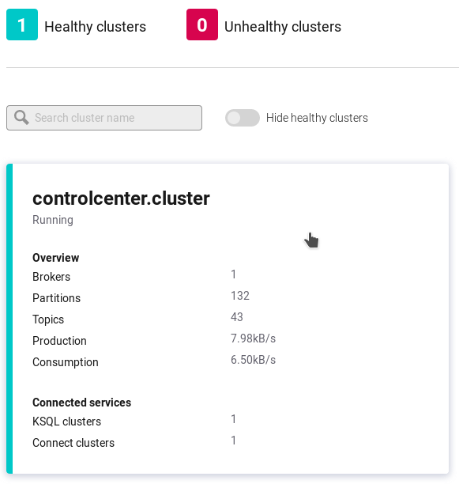
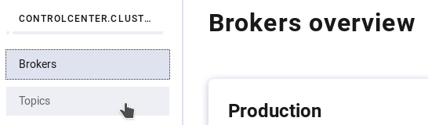
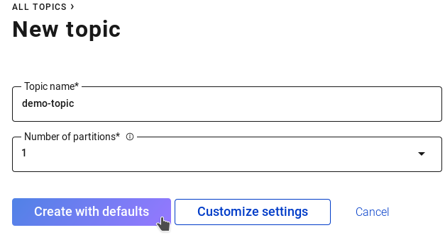
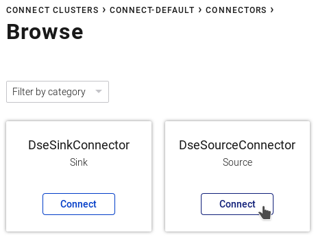
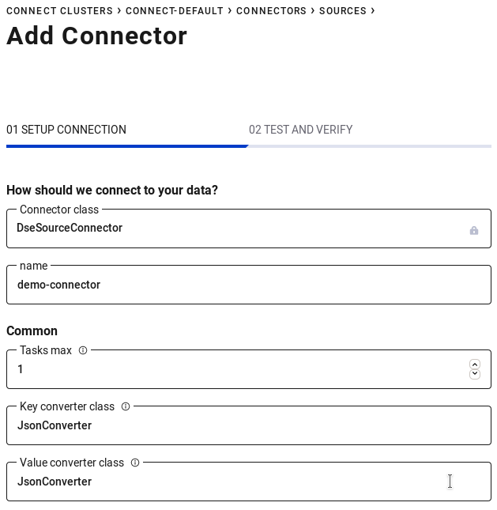
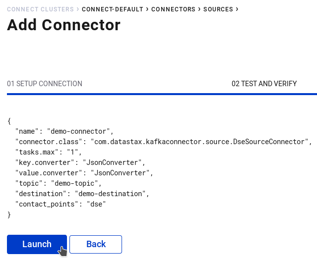
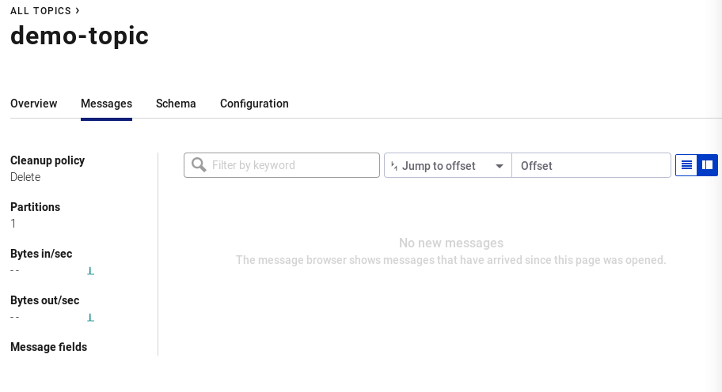

# DataStax CDC for Apache Kafka

Below is a guide for running and validating the DataStax Enterprise CDC
Connector for Apache Kafka. This builds on the excellent foundation of the
DataStax Apache Kafka Connector by adding CDC functionality as a Source
Connector.

## Install Dependencies

1. Install Docker
2. Install Docker Compose
3. Check out a copy of this repository
4. Download kafaka-connect-dse-2.0.0-20190925-LABS.jar from [DataStax
   Labs](https://downloads.datastax.com/#labs) and place it within this
   directory.

## Start the DataStax Enterprise and Apache Kafka Components

Note that the Source functionality of this connector will **ONLY** work with a
specific Labs Edition build of DataStax Enterprise 6.8.0. This build is
currently only available as a Docker container at
[datastaxlabs/dse-cdc-server](https://hub.docker.com/r/datastaxlabs/dse-cdc-server).
This container is referenced in the Docker Compose [configuration
file](https://github.com/datastax/labs/blob/master/kafka-connector-cdc/docker-compose.yml)
in this directory. This container does not have to be run within Docker compose,
it's included here as a way to ease testing efforts. 

This container does have modified `cassandra.yaml` and `dse.yaml` files.
`cassandra.yaml` has been tuned to reduce the periodic commit log sync to 500ms
and enable CDC. `dse.yaml` has DSE Advanced Replication enabled.

1. Start up the stack `docker-compose up -d`

If for some reason a component does not come up due to the order of containers
being started try running the command again.

## Configure DataStax Enterprise for Replication to Kafka
DataStax Enterprise Advanced Replication underpins the deduplication and
replication of mutations for a set of source tables, through a replication
channel, and to a destination. In this setup we must create a keyspace and table
to write messages to. Followed by a DSE Advanced Replication Destination and
Channel.

1. Configure DSE schema 

   ```
   docker-compose exec dse cqlsh
   ```

   ```
   CREATE KEYSPACE demo_ks WITH replication = {'class': 'NetworkTopologyStrategy', 'dc1': 1};
   CREATE TABLE demo_ks.demo_table (
     k TEXT,
     v TEXT,
     PRIMARY KEY ((k))
   );
   ```

2. Enable DSE Advanced Replication Destination for Kafka

   ```
   docker-compose exec dse dse advrep destination create --name demo_destination --transmission-enabled true
   docker-compose exec dse dse advrep destination list
   ```

3. Enable DSE Advanced Replication Channel for `demo_ks.demo_table`

   ```
   docker-compose exec dse dse advrep channel create --data-center-id dc1 --source-keyspace demo_ks --source-table demo_table --destination demo_destination --transmission-enabled true --collection-enabled true
   docker-compose exec dse dse advrep channel status
   ```

## Configure Kafka and the Connector
With everything configured within DSE it is now time to create a topic to
receive our mutations and an instance of the connector to process the CDC
messages.

1. Connect to the Confluent Control Panel http://localhost:9021/
2. Select the only cluster

   

3. Click "_Topics_" in the left sidebar

    

4. Click "_Add a topic_" in the top right corner
5. Enter the following parameters then click "_Create with defaults_"

    **Topic name:** demo-topic **Number of partitions:** 1

    

6. Open "_Connect_" in the left sidebar
7. Click "_connect-default_"
8. Click "_Add Connector_"
9. Click "_Connect_" under "_DseSourceConnector_"

   

10. Enter the following parameters and click "_Continue_"

    **Name:** demo-connector **Tasks max:** 1 **Key converter class:**
    JsonConverter **Value converter class:** JsonConverter **topic:** demo-topic
    **destination:** demo_destination **contact_points:** dse

     

11. Verify configuration parameters and click "_Launch_"

    

## Insert data to be replicated
1. Start `cqlsh` and insert data

    ```
    docker-compose exec dse cqlsh
    ```

    ```
    INSERT INTO demo_ks.demo_table (k, v) VALUES ('a', 'b');
    INSERT INTO demo_ks.demo_table (k, v) VALUES ('c', 'd');
    INSERT INTO demo_ks.demo_table (k, v) VALUES ('e', 'f');
    ```

## Validate behavior

1. Look in to number of messages waiting to be replicated

    ```
    docker-compose exec dse dse advrep replog count --source-keyspace demo_ks --source-table demo_table --destination demo_destination
    ```
2. Navigate to the topic view in the confluent control center
3. Click "_Topics_" in the left side bar
4. Select "_demo-topic_" from the list
5. Validate messages are being produced and consumed
6. Optionally look at the messages

   

   Note the record structure:

   * Key: JSON object representing all primary key columns
   * Value: JSON object representing all non-primary key columns
   * Timestamp: Microsecond timestamp of the mutation converted to milliseconds
   * Headers: Includes the keyspace name, table name, and replication type
     (INSERT, UPDATE, or DELETE)

## Limitations
* The DSE Kafka Connector with CDC is not recommended nor supported for
  production use. This release is an early preview of an unfinished product
  intended to allow proof of concept deployments and to facilitate early
  customer feedback into the software development process.
* The DSE Kafka Connector with CDC is compatible only with a specific DSE docker
  image co-hosted in the labs Docker Hub repository.
* Messages are replicated AFTER the mutation is fsync'd out to disk within the
  commitlog. By default this is every `10` seconds. This may be adjusted by
  changing the value of "commitlog_sync_period_in_ms" in cassandra.yaml. With an
  appropriate storage device backing your commitlog (read: SSD) values in the
  500ms to 3000ms are permitted.
* The DSE Kafka connector with CDC is built on the foundations of DataStax
  Enterprise Advanced Replication. With that in mind non-frozen collections and
  user-defined types are **NOT** supported. See the Advanced Replication [Data
  Types](https://docs.datastax.com/en/dse/6.7/dse-dev/datastax_enterprise/advReplication/advRepDataTypes.html)
  documentation for more information. 
* At this time it is not possible to run both Cassandra and Kafka CDC based
  Advanced Replication destinations simultaneously. To prevent any issues from
  occurring Cassandra based replication within DSE Advanced Replication is
  disabled.
